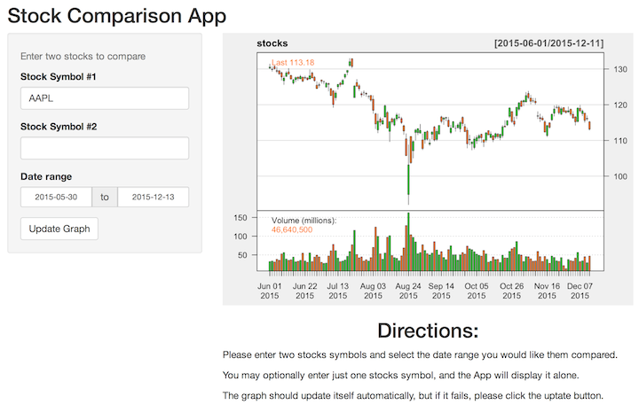

## Interactive Stock App with Shiny Controls
<BR>  

# Why another App?
   <BR>   <BR>

> 1. Vanilla stock graphs usually present one stock at a time
   <BR>   <BR>
   
> 2. But for investment you usually need to compare two stocks
   <BR>   <BR>
   
> 3. This App plots two stocks at the same time over a given period so that you can make a good comparison.
   <BR>   <BR>
   
> 4. Bonus: You also have the option to view the quotes one stock at a time.

---

## Original Stock App


```{r opts.label = 'shiny', cache=FALSE, warning=FALSE, echo=FALSE, eval=TRUE, error=FALSE}
suppressMessages(suppressWarnings(require(zoo)))
suppressMessages(suppressWarnings(require(xts)))
suppressMessages(suppressWarnings(require(TTR)))
suppressMessages(suppressWarnings(require(shiny)))
suppressMessages(suppressWarnings(require(slidify)))
suppressMessages(suppressWarnings(require(quantmod)))

shinyUI(fluidPage(
  
  fluidRow(
    # This is here due to a bug in slidify
    column(4,
            img(src = "assets/img/Stock_Comparison_App_screenshot_single_stock_original_small.png", align = "right")),
  
    column(2,
      helpText("Select a stock to examine. 
        Information will be collected from yahoo finance."),
      br(),
      br(),
      textInput("symb", "Symbol", "SPY"),
      br(),
      br(),
      helpText("Date range: "),
      br(),
      br(),
      textInput("start", "start", "2015-05-30"),
      br(),
      textInput("end", "end", "2015-12-13"),
      br(),
      br(),   
      actionButton("get", "Get Stock"),
      br(),
      br()
    )
  )
))
```

---

## Interactive Stock Comparison App

# Single stock view
<BR>



---

## Interactive Stock Comparison App

# Double stock view
<BR>


