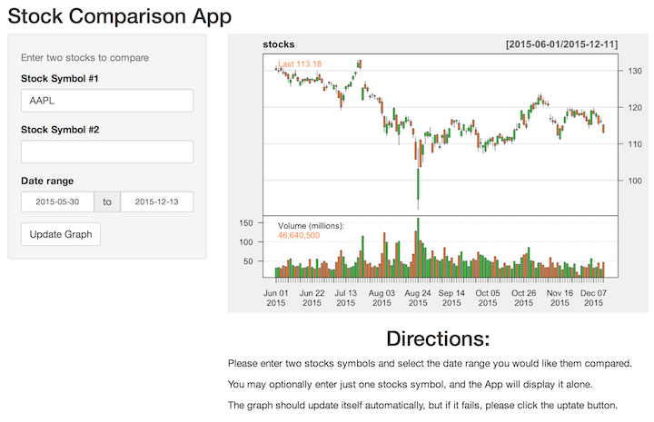
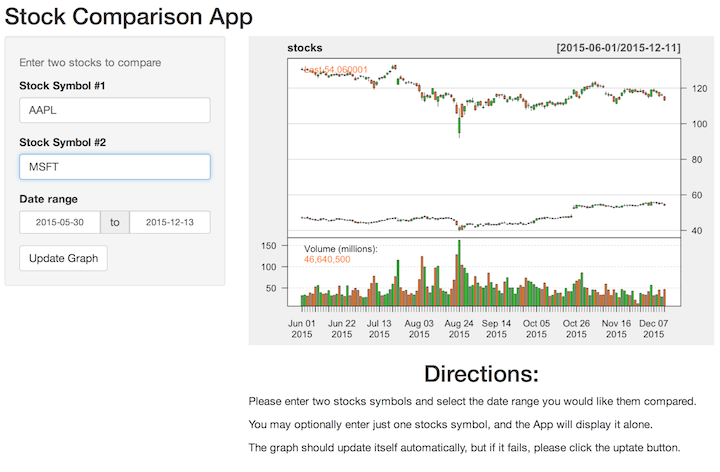

## Interactive Stock App with Shiny Controls
<BR>  

# Why another App?
   <BR>   <BR>

> 1. Vanilla stock graphs usually present one stock at a time
   <BR>   <BR>
   
> 2. But for investment you usually need to compare two stocks
   <BR>   <BR>
   
> 3. This App plots two stocks at the same time over a given period so that you can make a good comparison.
   <BR>   <BR>
   
> 4. Bonus: You also have the option to view the quotes one stock at a time.

---

## Original Stock App


```
## Warning: package 'quantmod' was built under R version 3.1.3
```

```
## Loading required package: xts
## Loading required package: zoo
```

```
## Warning: package 'zoo' was built under R version 3.1.3
```

```
## 
## Attaching package: 'zoo'
## 
## The following objects are masked from 'package:base':
## 
##     as.Date, as.Date.numeric
## 
## Loading required package: TTR
```

```
## Warning: package 'TTR' was built under R version 3.1.3
```

```
## Version 0.4-0 included new data defaults. See ?getSymbols.
```

```
## Error in eval(expr, envir, enclos): could not find function "slidifyUI"
```

---

## Interactive Stock Comparison App

# Single stock view
<BR>



---

## Interactive Stock Comparison App

# Double stock view
<BR>




